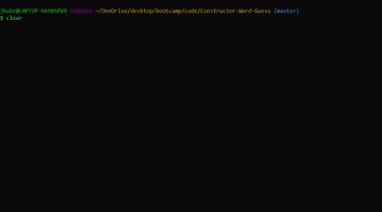

# Constructor-Word-Guess 📖

## About Fruity Word Guess  🍎 🍊 🍐 🍌 🍈 🥝

This is a command-line word guessing game, built using advanced Javascript and constructor functions. The app receives user input by utilizing the NPM package 'inquirer'.



## How to Use 🤔

The user will first be prompted to select a difficulty, which will determine the amount of guesses they begin with. From there the app will log a word, hidden with underscores, for the user to guess. The user can guess any letter from A to Z, one character at a time.

The `difficulty` levels:

* `Easy` - 10 guesses
* `Medium` - 7 guesses
* `Hard` - 3 guesses


**Remember**
If the user correctly guesses all of the hidden letters they receive a `You Win` and their `wins` increase by 1

BUT...

If the user reaches 0 guesses they receive a `Game Over` and their `losses` increase by 1

<!-- ## How it Works 🔨

### 🎧 spotify-this-song


The `spotify-this-song` command searches the `Node-Spotify-API` by sending user input as a parameter for the call to retrieve relevant song information.

``` 
spotify.search({ type: 'track', query: input }, function (err, data) {
    if (err) {
        // Log error
        console.log(
            "~~~~~~~~~~~~~~~~~~~~~~~~~~~~~~~~~~~~~~~~~~~~~~~~~~~~~~~~~~~~~~~~~" + "\r\n" +             
            "          Oops... LIRI cannot find any data         >.<" + "\r\n" +
            "~~~~~~~~~~~~~~~~~~~~~~~~~~~~~~~~~~~~~~~~~~~~~~~~~~~~~~~~~~~~~~~~~" + "\r\n" +          
            'Error occurred: ' + err
        );
        return;
    } else if (!err) {
        // Store data object
        let songData = data.tracks.items
        let song = songData[0];
        // Log song data for user
        console.log(
            "~~~~~~~~~~~~~~~~~~~~~~~~~~~~~~~~~~~~~~~~~~~~~~~~~~~~~~~~~~~~~~~~~" + "\r\n" +                 
            "\r\n" + "       LIRI Spotify response for " + input + "!" + "\r\n" + "\r\n" +              
            "_________________________________________________________________"
        );
            // Iterate through artist array if multiple artists
            for(var i = 0; i < song.artists.length; i++) {
                console.log("Artist:       " + song.artists[i].name);
            }
        console.log(
            "_________________________________________________________________" + "\r\n" + 
            "Song:         " + song.name + "\r\n" + 
            "_________________________________________________________________" + "\r\n" + 
            "Album:        " + song.album.name + "\r\n" + 
            "_________________________________________________________________" + "\r\n" + 
            "Preview:      " + song.preview_url + "\r\n" + 
            "_________________________________________________________________" + "\r\n" + "\r\n" +
            "~~~~~~~~~~~~~~~~~~~~~~~~~~~~~~~~~~~~~~~~~~~~~~~~~~~~~~~~~~~~~~~~~"
        );
    }
});
```

#### Examples

* `spotify-this-song "Bohemian Rhapsody"`
* `spotify-this-song "Never Gonna Give You Up"`
* `spotify-this-song "2009 Mac Miller"`

The *Spotify API* requires you sign up as a developer to generate the necessary credentials. You can either login to your existing Spotify account or create a new one (a free account is fine) and log in. From there you will be able to generate a **client id** and **client secret**.

## Pre-Requisites

To retrieve the data that will power this app, you'll need to send requests using NPM packages. Downloading the following Node packages is crucial for this applications functionality.

* Node-Spotify-API `npm install node-spotify-api`
* Axios `npm install axios`
* Moment `npm install moment`
* DotEnv `npm install dotenv`
* Colors `npm install colors`

## Getting Started 🏁

The following steps will get you a copy of the application up and running on your local machine for testing and grading puproses.

1. Clone this repository from github.
2. Git clone repository in IDE of choice
3. Open folder in text-editor of choice
4. Create a `.env` file (Personal credentials will live here)
5. In `.env` place these lines:
`SPOTIFY_ID=<YOUR SPOTIFY ID HERE>`
`SPOTIFY_SECRET=<YOUR SPOTIFY SECRET HERE>`
`OMDB_API=<YOUR OMDB API KEY HERE>`
6. If all pre-requisites are met, open application in IDE and run by typing `node liri.js`!

## Technologies Used 💻

* Axios
* Git
* Javascript ES5
* JSON
* Node.js
* NPM
* Moment.js
* VS Code -->

## Creator ✋

**Joey Kubalak**

AKA 

👇

*Treez*

Github profile 👉 [TreezCode](https://github.com/TreezCode)