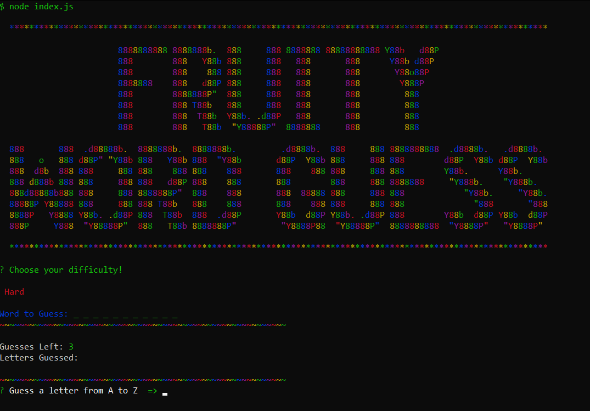
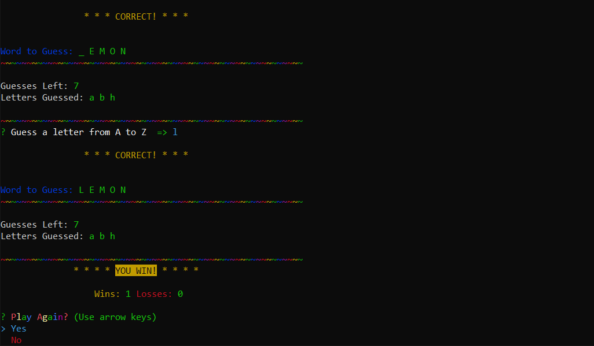
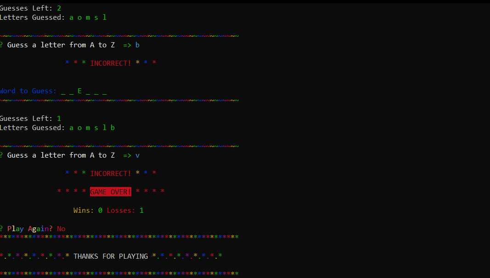

# Constructor-Word-Guess 📖

## About Fruity Word Guess  🍎 🍊 🍐 🍌 🍈 🥝

This is a command-line word guessing game, built using advanced Javascript and constructor functions. A random word is generated from a word bank and the user must guess, ONE letter at a time, to complete the word. The app receives and stores user input by utilizing the NPM package `inquirer`. Various `Javascript` functions are then called to validate and check guess correctness.


## How to Use 🤔

The user will first be prompted to select a difficulty, which will determine the amount of guesses they begin with. From there the app will log a word, hidden with underscores, for the user to guess. The user can guess any letter from A to Z, one character at a time.

The `difficulty` levels:

* `Easy` - 10 guesses
* `Medium` - 7 guesses
* `Hard` - 3 guesses


**Remember**

If the user correctly guesses all of the hidden letters they receive a `You Win` and their `wins` increase by 1

BUT...

If the user reaches 0 guesses they receive a `Game Over` and their `losses` increase by 1

## How it Works 🔨

### Game Logic 🎮

The user starts the game by running the `node index.js` command to initialize the app. There are 3 seperate `js` files that are utilized to perform the logic. The files are isolated by *letter*, *word*, and *index* (main logic) functions, and then exported to be used together.

The **NPM Package** `inquirer` is called when the main logic of the application is ran. This *prompts* the user for input, which is then stored and further used for various functions throughout the game.

``` 
  // Begin user prompt if the word is not complete
  if (wordComplete.includes(false)) {
    inquirer.prompt([
      {
        type: "input",
        message: "Guess a letter from A to Z  ".white + "=>" ,
        name: "userInput"
      }
    ]).then(input => {

        // Validate user input
        if (!alphabet.includes(input.userInput) || input.userInput.length > 1) {

          console.log("\nPlease enter a letter from A to Z... ONE at a time! >.< \n".cyan);
          gameLogic();
        } else {
          if (wrongLetters.includes(input.userInput) || correctLetters.includes(input.userInput) || input.userInput === "") {
            console.log("\nYou've already tried that letter or nothing was entered!\n".cyan);
            gameLogic();
          } 
            // User input is valid then do this logic
            else {

            let checkerArray = [];

            cpuWord.userGuess(input.userInput);
            cpuWord.objArray.forEach(wordCheck);

            if (checkerArray.join("") === wordComplete.join("")) {
              console.log("\r\n                * * * ".rainbow + "INCORRECT!".red + " * * *\r\n".rainbow);
              wrongLetters.push(input.userInput);
              guessesLeft --;
            } else {
              console.log("\r\n                * * * CORRECT! * * *\r\n".yellow);
              correctLetters.push(input.userInput);
            }

            // Handle the guesses left
            if (guessesLeft > 0) {
              gameLogic();
            } else {
              losses++;
              console.log("              * * * * ".red + "GAME OVER!".bgRed.black + " * * * * \n".red);
              playAgain();
            }
            function wordCheck(key) {
              checkerArray.push(key.isGuessed);
            }
          }
        }
    });
```

#### Screenshots 📷







## Pre-Requisites

To power this app, you'll need to a install a couple `NPM Packages`. Downloading the following Node packages is crucial for this applications functionality.

* Inquirer `npm install inquirer`
* Colors `npm install colors`

## Getting Started 🏁

The following steps will get you a copy of the application up and running on your local machine for testing and grading puproses.

1. Copy this repository from github by using clone.
2. Git clone repository in IDE of choice
3. Navigate to proper directory in IDE
4. If all pre-requisites are met, initalize game by typing `node index.js`!
5. ENJOY!

## Technologies Used 💻

* Git
* Inquirer
* Javascript ES6
* JSON
* Node.js
* NPM
* VS Code

## Creator ✋

**Joey Kubalak**

AKA 

👇

*Treez* 🌲

Github profile 👉 [TreezCode](https://github.com/TreezCode)